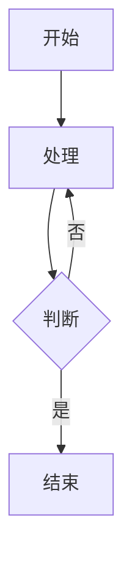

# Markdown解析器使用文档

## 功能特性

增强的Markdown解析器支持以下功能：

### 1. 通用Markdown标记
- 标题（h1-h6）
- 列表（有序、无序）
- 引用块
- 链接和图片
- 表格
- 分隔线

### 2. 代码块解析
- 支持语法高亮（使用highlight.js）
- 显示代码行号
- 显示编程语言标签
- 支持行内代码

示例：
```javascript
function hello() {
  console.log('Hello World')
}
```

### 3. LaTeX数学公式
- 行内公式：使用单个`$`符号包裹
- 块级公式：使用双`$$`符号包裹

示例：
- 行内公式：$E = mc^2$
- 块级公式：
$$
\int_{-\infty}^{\infty} e^{-x^2} dx = \sqrt{\pi}
$$

### 4. Mermaid流程图
支持Mermaid格式的流程图、时序图、甘特图等。

示例：


### 5. 自定义格式解析
可以注册自定义的解析函数来处理特定格式。

## 使用方法

### 基本使用

在Vue组件中使用`MarkdownRenderer`组件：

```vue
<template>
  <MarkdownRenderer :content="markdownText" />
</template>

<script setup>
import MarkdownRenderer from '@/components/MarkdownRenderer.vue'
import { ref } from 'vue'

const markdownText = ref('# Hello World')
</script>
```

### 自定义解析器

注册自定义解析函数：

```javascript
import { registerCustomParser, unregisterCustomParser } from '@/utils/markdownParser'

// 定义自定义解析器
function myCustomParser(text) {
  // 处理特定格式，例如：@用户名 转换为链接
  return text.replace(/@(\w+)/g, '<a href="/user/$1">@$1</a>')
}

// 注册解析器
registerCustomParser(myCustomParser)

// 取消注册
unregisterCustomParser(myCustomParser)
```

### 同步解析

如果不需要Mermaid等异步渲染，可以使用同步模式：

```vue
<MarkdownRenderer :content="markdownText" :async="false" />
```

### 直接调用解析函数

```javascript
import { parseMarkdown, parseMarkdownSync } from '@/utils/markdownParser'

// 异步解析（支持Mermaid）
const html = await parseMarkdown(markdownText)

// 同步解析（不支持Mermaid）
const html = parseMarkdownSync(markdownText)
```

## API说明

### MarkdownRenderer组件

Props：
- `content`: String - 要解析的Markdown文本
- `async`: Boolean - 是否使用异步模式（默认true）

### markdownParser工具函数

- `parseMarkdown(text)`: 异步解析Markdown
- `parseMarkdownSync(text)`: 同步解析Markdown
- `registerCustomParser(parser)`: 注册自定义解析器
- `unregisterCustomParser(parser)`: 取消注册自定义解析器
- `initMermaid()`: 初始化Mermaid配置

## 样式自定义

组件已包含默认样式，如需自定义，可以在父组件中覆盖：

```css
:deep(.code-block) {
  background-color: #your-color;
}

:deep(.katex-block) {
  background-color: #your-color;
}

:deep(.mermaid-container) {
  background-color: #your-color;
}
```

## 注意事项

1. 使用前请确保已安装依赖：
   ```bash
   npm install katex mermaid
   ```

2. LaTeX公式使用KaTeX库渲染，支持大部分LaTeX语法

3. Mermaid图表在异步模式下渲染，首次加载可能需要短暂等待

4. 自定义解析器按注册顺序执行，可以注册多个解析器

5. 代码块行号使用CSS实现，不影响复制功能
