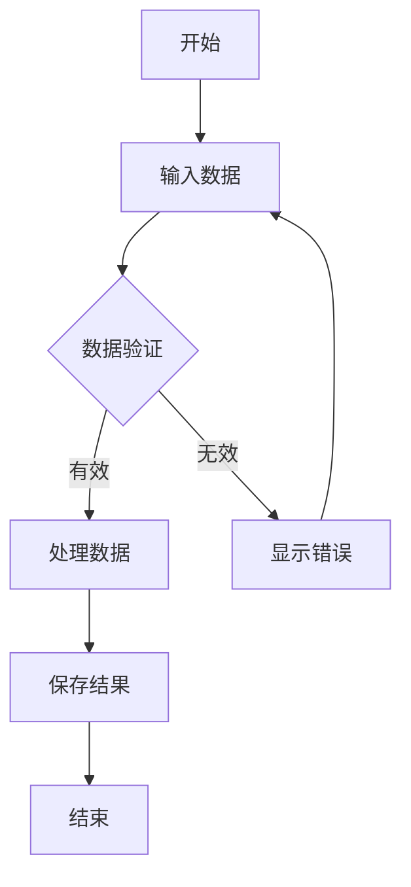
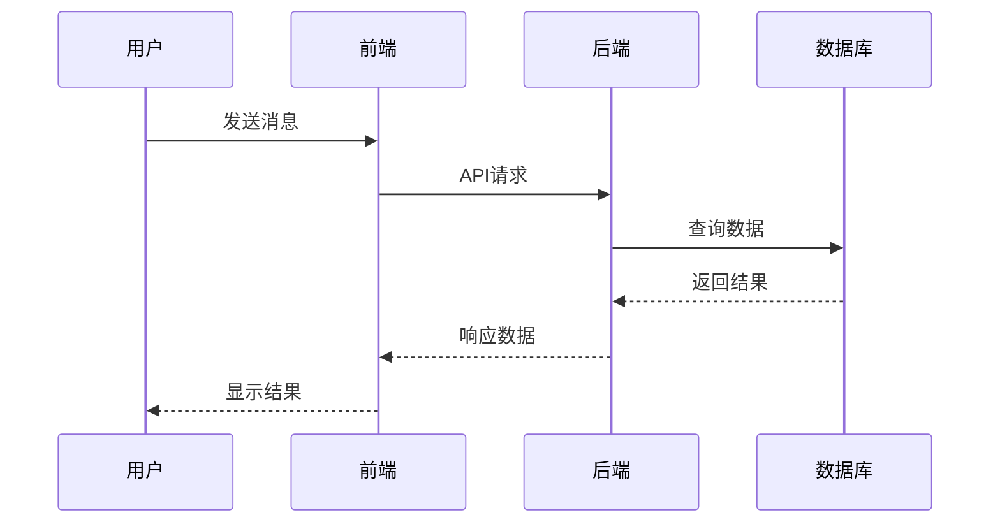

# Markdown解析器测试示例

## 1. JavaScript代码示例

```javascript
function fibonacci(n) {
  if (n <= 1) return n
  return fibonacci(n - 1) + fibonacci(n - 2)
}

const result = fibonacci(10)
console.log(`Fibonacci(10) = ${result}`)
```

## 2. Python代码示例

```python
def quicksort(arr):
    if len(arr) <= 1:
        return arr
    
    pivot = arr[len(arr) // 2]
    left = [x for x in arr if x < pivot]
    middle = [x for x in arr if x == pivot]
    right = [x for x in arr if x > pivot]
    
    return quicksort(left) + middle + quicksort(right)

# 测试
numbers = [3, 6, 8, 10, 1, 2, 1]
print(quicksort(numbers))
```

## 3. Java代码示例

```java
public class HelloWorld {
    public static void main(String[] args) {
        System.out.println("Hello, World!");
        
        for (int i = 0; i < 5; i++) {
            System.out.println("Count: " + i);
        }
    }
}
```

## 4. 数学公式示例

行内公式：质能方程 $E = mc^2$

块级公式：

$$
\sum_{i=1}^{n} i = \frac{n(n+1)}{2}
$$

积分公式：

$$
\int_{-\infty}^{\infty} e^{-x^2} dx = \sqrt{\pi}
$$

## 5. Mermaid流程图示例



## 6. 时序图示例



## 7. 其他Markdown功能

### 列表
- 无序列表项1
- 无序列表项2
  - 嵌套项1
  - 嵌套项2

1. 有序列表项1
2. 有序列表项2
3. 有序列表项3

### 引用
> 这是一段引用文字
> 可以有多行

### 表格
| 语言 | 用途 | 难度 |
|------|------|------|
| JavaScript | 前端开发 | 中等 |
| Python | 数据科学 | 简单 |
| Java | 企业应用 | 中等 |

### 行内代码
使用 `npm install` 安装依赖，使用 `import` 导入模块。
